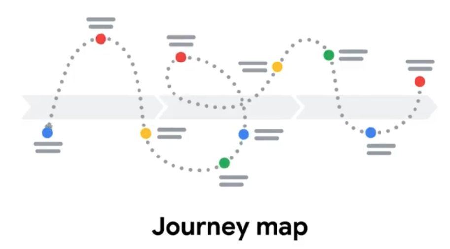
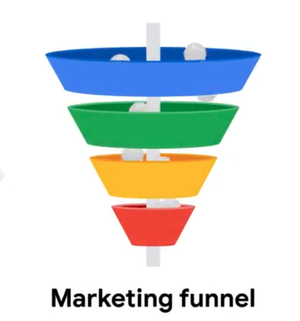

### Marketing funnel

A visual representation of the process through which people go from first learning about a brand to becoming loyal customers.

Note:
A marketing funnel is a visual representation of the process through which people go from first learning about a brand to becoming loyal customers.

Four stages of the marketing funnel
1. awareness - Knowing the existence
2. consideration - Checking more details about it
3. conversion - Deciding to buy
4. loyalty - Making the customer for more purchase

#### Target audience
The group of people most likely to purchase a company's products

A journey map adopts the customer's perspective,
but a funnel considers that same process from the position of the business

