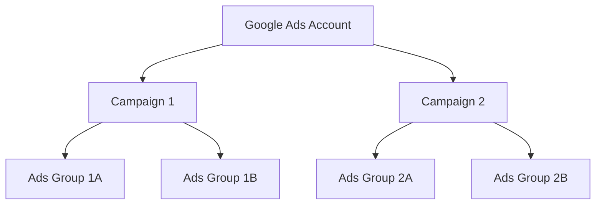

## Google Ads account structure and organization explanation.

-**Google Ads:** online advertising program, that you can create online ads

```mermaid
graph TD
    A[Google Ads Account] --> B[Campaign 1]
    A --> C[Campaign 2]
    B --> D[Ads Group 1A]
    B --> E[Ads Group 1B]
    C --> F[Ads Group 2A]
    C --> G[Ads Group 2B]
```