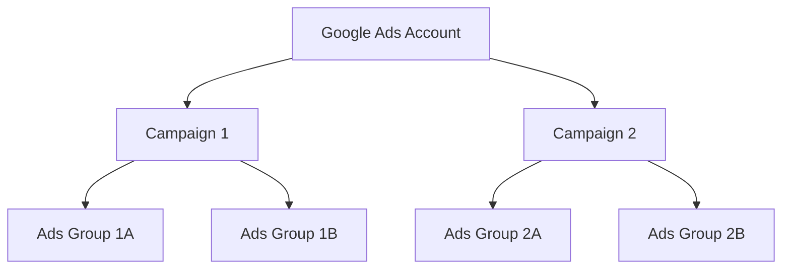

## Google Ads account structure and organization explanation.

-**Google Ads:** online advertising program, that you can create online ads

- **Google Ads:** Google's online advertising program. Through Google Ads, you can create online ads to reach people exactly when they're interested in the products and services that you offer.
- **Campaign:** A plan of action for how a set of one or more ad groups that share a budget, location targeting, and other settings will be distributed online. Campaigns are often used to organize categories of products or services that you offer.
- **Average daily budget:** The average amount that you set for each ad campaign on a per-day basis. It specifies roughly how much you are comfortable spending each day over the course of month.
- **Ad Groups:** The way to organize and target ads into themed groups of keywords. Each of your campaigns is made up of one or more ad groups.
- **Ad Formats:** Text, videos, images, digital content ads, and more that appear alongside used to promote products and services with Google Ads.
- **Bids:** The amount you're willing to spend each time a potential customer clicks your ad or calls you in known as bids.
- **Keywords:** These are words or phrases describing your product or service that you choose to help determine when and where your ad can appear. Advertisers bid against each other, and ads are ranked based on how high you bid and how relevant your ad is, among other factors.